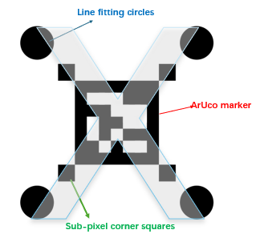

<strong>X-ArUco marker</strong>

    

Inspired by An [improved ArUco marker for monocular vision ranging](https://ieeexplore.ieee.org/abstract/document/9164176?casa_token=I9WTCcT0EyQAAAAA:n9Ld84hGma-YoSFS_ffma39R5ZnIS0J-U1nGKxDYHda_smcigJmrn_6jdPAVPBV7P5ccL6NALR8C) and [ArUcoE: Enhanced ArUco Marker](https://ieeexplore.ieee.org/abstract/document/9650050?casa_token=WRMuf3ExGccAAAAA:KcY0MHtz3LD71bEqiNOW2WoOVOvd2J4ZQjSi6E9w8QeWyQ_NmF9RmjNS2s0Km5FG4cplhzCbuBBY)

  Combine the line fitting and sub-pixel methods.  
  
  Re-projection error imporved almost **70%**  
  but poor robust.  
  

  Once it can be detected, better accuracy than ArUco.

